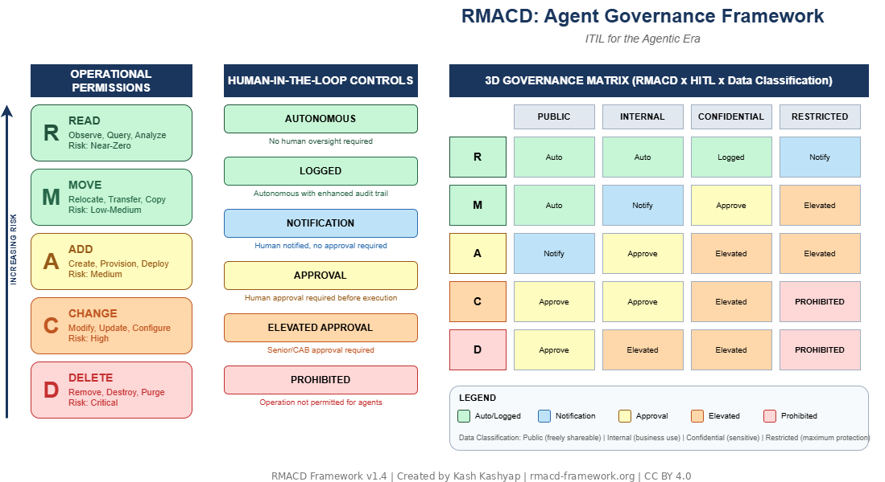

# RMACD: AI Agent Governance Framework

**ITIL for the Agentic Era**

[](https://creativecommons.org/licenses/by/4.0/)
[](https://github.com/rmacdframework/spec/releases)
[](https://pypi.org/project/rmacd-framework/)
[](https://pypi.org/project/rmacd-framework/)

---

## Overview

The **RMACD Framework** (Read, Move, Add, Change, Delete) is a governance model for autonomous AI agents in enterprise IT operations. It integrates:

- **Operational Permissions** — Five graduated tiers (R→M→A→C→D) based on risk
- **Human-in-the-Loop Controls** — Six autonomy levels from fully autonomous to prohibited
- **Data Classification** — Optional integration with enterprise data sensitivity tiers

RMACD answers the fundamental governance question: *"What can this agent do, to what data, with what oversight?"*

---

## Framework Diagram

### Conceptual model



*[Edit diagram (draw.io)](docs/RMACD_Framework_Diagram.drawio)*

### Runtime architecture (Appendix C, with SDK class overlay)


*[Edit diagram (draw.io)](docs/RMACD_Runtime_Architecture.drawio) · Regenerate PNG with `python docs/render_drawio_to_png.py docs/RMACD_Runtime_Architecture.drawio`*

---

## Quick Start

### The Five Operations

| Operation | Risk Level | Description |
|-----------|------------|-------------|
| **R**ead | Near-Zero | Observe, query, analyze — no state change |
| **M**ove | Low-Medium | Relocate, transfer — reversible |
| **A**dd | Medium | Create, provision — additive impact |
| **C**hange | High | Modify, update — state mutation |
| **D**elete | Critical | Remove, destroy — potentially irreversible |

### Implementation Models

| Model | Dimensions | Best For |
|-------|-----------|----------|
| **Three-Dimensional** | RMACD × HITL × Data Classification | Default. Regulated industries, mature data governance. |
| **Two-Dimensional (Operational)** | RMACD × HITL | Organizations without formal data classification tiers. |
| **Two-Dimensional (Data-Classification, DC2D)** | Data Classification × HITL | Organizations whose primary governance lever is data sensitivity; operations governed by an upstream IAM/RBAC or DLP layer. See [Appendix D](docs/RMACD_Framework_v1.4.md#appendix-d-the-data-classification-two-dimensional-variant-dc2d). |

---

## Governance Matrix (Three-Dimensional Model)

|  | Public | Internal | Confidential | Restricted |
|--|--------|----------|--------------|------------|
| **Read** | Auto | Auto | Logged | Notify |
| **Move** | Auto | Notify | Approve | Elevated |
| **Add** | Notify | Approve | Elevated | Elevated |
| **Change** | Approve | Approve | Elevated | **Prohibited** |
| **Delete** | Approve | Elevated | Elevated | **Prohibited** |

---

## Documentation

- [Full Specification (Markdown)](docs/RMACD_Framework_v1.4.md) — Recommended for reading on GitHub
- [Full Specification (Word)](docs/RMACD_Framework_v1.4.docx) — Original document format
- [Framework Diagram (PNG)](docs/RMACD_Framework_Diagram.drawio.png) — Conceptual model (R/M/A/C/D × HITL)
- [Framework Diagram (draw.io)](docs/RMACD_Framework_Diagram.drawio) — Editable conceptual source
- [Runtime Architecture Diagram (draw.io)](docs/RMACD_Runtime_Architecture.drawio) — PDP/PEP/Audit/Approval with SDK class overlay
- [Implementation Guide](docs/implementation.md)
- [Runtime Patterns](docs/runtime-patterns.md) — How an agent runtime consumes RMACD: profile binding, classification lookup, approval-wait, error contract, agent self-restriction
- [Python SDK](sdk/python/) — `rmacd-framework` on PyPI; `PolicyEvaluator`, `PolicyEnforcer`, profiles, audit, approval
- [Claude Agent SDK integration example](examples/agent-integration-claude-sdk/) — Runnable RMACD-governed agent (PreToolUse hook)
- [Raw Anthropic SDK integration example](examples/agent-integration-anthropic-sdk/) — Runnable RMACD-governed agent (manual tool-use loop)
- [DC2D customer-support example](examples/dc2d-customer-support/) — Redaction + egress controls demo (DC2D variant)
- [Framework adapters](docs/framework-adapters.md) — registry-backed `enforce_tool_call` for OpenAI Agents SDK, Microsoft Agent Framework, Claude Agent SDK, LangChain, AutoGen, CrewAI
- [Python Tools Registry](sdk/python/rmacd/registry/) — First-class tool→RMACD classifier + capability ceiling, consulted by `PolicyEnforcer.enforce_tool_call`; MCP auto-classification (`MCPRegistryBridge`) with optional Claude-powered classification (`LLMToolClassifier`, `pip install rmacd-framework[llm]`)
- [JSON Schema Templates](schemas/)
- [Website](https://rmacd-framework.org)

---

## Installation

RMACD is a governance specification, not a software package. To implement:

1. **Assess** your organization's data classification maturity
2. **Select** the Two-Dimensional or Three-Dimensional model
3. **Define** permission profiles for your agent types
4. **Integrate** with your agent runtime/orchestration platform

See the [Implementation Guide](docs/implementation.md) for details.

---

## JSON Permission Profiles

Example profile for a read-only monitoring agent:

```json
{
  "$schema": "https://rmacd-framework.org/schema/v1/profile-2d.json",
  "profile_id": "rmacd-2d-observer-v1",
  "profile_name": "Observer",
  "model": "two-dimensional",
  "version": "1.0",
  "permissions": ["R"],
  "constraints": {
    "environments": ["development", "staging", "production"],
    "rate_limits": {
      "queries_per_minute": 100
    }
  }
}
```

See [schemas/examples/](schemas/examples/) for more profiles.

---

## Citation

If you use the RMACD Framework in your work, please cite:

```bibtex
@software{kashyap2026rmacd,
  author       = {Kashyap, Kash},
  title        = {RMACD: AI Agent Governance Framework},
  year         = {2026},
  month        = jun,
  version      = {1.4.0},
  url          = {https://rmacd-framework.org},
  howpublished = {\url{https://github.com/rmacdframework/spec}},
  license      = {CC-BY-4.0},
  note         = {ORCID: 0009-0005-0127-6265}
}
```

Or see [CITATION.cff](CITATION.cff) for machine-readable citation.

---

## Contributing

We welcome contributions! Please see [CONTRIBUTING.md](CONTRIBUTING.md) for guidelines.

Questions, ideas, or feedback? Join the conversation in [GitHub Discussions](https://github.com/rmacdframework/spec/discussions).

---

## License

This work is licensed under [Creative Commons Attribution 4.0 International (CC BY 4.0)](LICENSE).

You are free to share and adapt this material with appropriate attribution.

---

## Author

**Created by Kash Kashyap** — January 2026

Email: kash@rmacd-framework.org  
Web: [rmacd-framework.org](https://rmacd-framework.org)  
ORCID: [0009-0005-0127-6265](https://orcid.org/0009-0005-0127-6265)
LinkedIn: [linkedin.com/in/kashkashyap](https://linkedin.com/in/kashkashyap)

---

*RMACD: AI Agent Governance Framework — ITIL for the Agentic Era*
