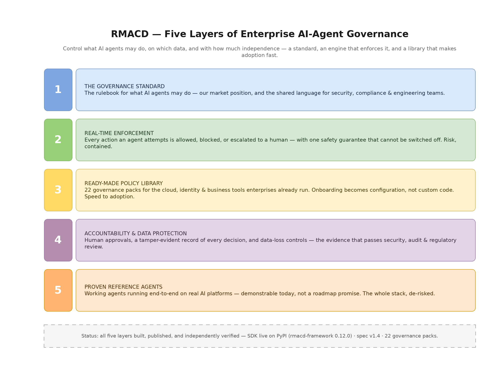

# RMACD: AI Agent Governance Framework

**ITIL for the Agentic Era**

[](https://doi.org/10.5281/zenodo.21438139)
[](https://creativecommons.org/licenses/by/4.0/)
[](https://github.com/rmacdframework/spec/releases)
[](https://pypi.org/project/rmacd-framework/)
[](https://pypi.org/project/rmacd-framework/)

---

## Overview

The **RMACD Framework** (Read, Move, Add, Change, Delete) is a governance model for autonomous AI agents in enterprise IT operations. It integrates three axes:

| Axis | What it controls | Values |
|------|------------------|--------|
| **Operational Permissions** | What kind of action the agent may take | Five graduated tiers by risk, cumulative: R → M → A → C → D |
| **Human-in-the-Loop Controls** | How much oversight each action needs | Six autonomy levels, fully autonomous through prohibited |
| **Data Classification** | How sensitive the data being acted on is | Four tiers — optional; omit it for the 2D shape |

RMACD answers the fundamental governance question: *"What can this agent do, to what data, with what oversight?"*

---

## Use with Claude Code

RMACD ships as a [Claude Code](https://claude.com/claude-code) plugin — three steps from zero to a governed session:

```
claude plugin marketplace add rmacdframework/spec
claude plugin install rmacd@rmacd-framework
```

then, inside a session:

```
/rmacd:init
```

Install the SDK into the Python environment your session's `python3` resolves to (the `[mcp]` extra is optional — it adds the `rmacd mcp-serve` policy server for MCP clients):

```bash
pip install "rmacd-framework[mcp]>=0.14"
```

Beyond scaffolding governance for agents you build, the plugin governs the **Claude Code session itself**: a deterministic `PreToolUse` hook (`python3 -m rmacd.claude_code.hook`) classifies every Bash, file-edit, and MCP tool call into RMACD terms and evaluates it against a bound profile before the tool runs. With the read-only `observer-3d` profile bound, reads pass through untouched while a `rm -rf` is refused with a decision that cites the operation, tier, rule, and profile — `RMACD: Delete on internal target 'bash:rm' denied — Operation D not permitted for this profile. Rule: bash classifier: rm. Profile: rmacd-3d-observer-v1.`

What the session gets, at a glance:

| Hook | What it does |
|------|--------------|
| `SessionStart` | States the governance state once, up front — which profile bound the session, or that none did |
| `PreToolUse` | Classifies and decides before the tool runs: `allow`, `deny` with a cited reason, or `ask` (approval-level autonomy maps to Claude Code's own permission prompt), and records the decision |
| `PostToolUse` | Records the execution outcome for calls that ran, joined to its decision by `tool_use_id` |

Bound sessions **fail closed** — including when a profile is configured but the SDK cannot be imported, in which case a stdlib-only wrapper denies every tool call and names the fix. Unbound sessions stay zero-friction: no decision is emitted and Claude Code's own permission flow is untouched. A bound session writes its audit trail to `.claude/rmacd-audit.jsonl` beside the profile.

See [docs/claude-code.md](docs/claude-code.md) for setup, enterprise managed-settings rollout, the normative fail-mode table, and configuration, and the [plugin README](plugins/rmacd/README.md) for what's inside (`/rmacd:init`, `/rmacd:status`, `/rmacd:bug-setup`, skills, hooks).

---

## The Five Layers

What we've built, from the standard up to running agents. Each layer links to its documentation.



*[Edit diagram (draw.io)](docs/RMACD_Layers_Overview.drawio) · Regenerate PNG with `python docs/render_drawio_to_png.py docs/RMACD_Layers_Overview.drawio`*

| Layer | What it is | Documentation |
|-------|-----------|---------------|
| **1 · The Governance Standard** | The rulebook for what an agent may do, on which data, with what oversight — the shared language for security, compliance & engineering. | [Specification v1.4](docs/RMACD_Framework_v1.4.md) · [Conceptual model](docs/RMACD_Framework_Diagram.drawio.png) · [DC2D variant](docs/RMACD_Framework_v1.4.md#appendix-d-the-data-classification-two-dimensional-variant-dc2d) · [Intents — the adjudication mode](docs/intents.md) |
| **2 · Real-Time Enforcement** | The engine that checks every agent action — allow, block, or escalate to a human — with the §12.5 safety floor that cannot be overridden. | [Python SDK](sdk/python/) · [Runtime patterns](docs/runtime-patterns.md) · [Framework adapters](docs/framework-adapters.md) |
| **3 · Ready-Made Policy Library** | 34 built-in governance packs for the cloud, identity, developer & business tools enterprises already run — onboarding becomes configuration, not code. | [Governance Packs](docs/governance-packs/) · [Pack catalog](docs/governance-packs/catalog.md) · [Authoring guide](docs/governance-packs/authoring-guide.md) |
| **4 · Accountability & Data Protection** | Human approvals on risky actions, a tamper-evident audit trail of every decision, and redaction/egress controls for sensitive data. | [Implementation guide](docs/implementation.md) · [DC2D redaction + egress demo](examples/dc2d-customer-support/) · [Runtime patterns](docs/runtime-patterns.md#5-approval-wait-semantics-for-llm-agents) |
| **5 · Proven Reference Agents** | Working, RMACD-governed agents running end-to-end on real AI platforms — demonstrable today, not a roadmap promise. | [Claude Agent SDK](examples/agent-integration-claude-sdk/) · [Anthropic SDK](examples/agent-integration-anthropic-sdk/) · [Packs quickstart](examples/governance-packs-quickstart/) |

---

## Framework Diagram

### Conceptual model


*[Edit diagram (draw.io)](docs/RMACD_Framework_Diagram.drawio)*

### Runtime architecture (Appendix C, with SDK class overlay)


*[Edit diagram (draw.io)](docs/RMACD_Runtime_Architecture.drawio) · Regenerate PNG with `python docs/render_drawio_to_png.py docs/RMACD_Runtime_Architecture.drawio`*

---

## Quick Start

### The Five Operations

| Operation | Risk Level | Description |
|-----------|------------|-------------|
| **R**ead | Near-Zero | Observe, query, analyze — no state change |
| **M**ove | Low-Medium | Relocate, transfer — reversible |
| **A**dd | Medium | Create, provision — additive impact |
| **C**hange | High | Modify, update — state mutation |
| **D**elete | Critical | Remove, destroy — potentially irreversible |

### Implementation Models

| Model | Dimensions | Profile ID pattern | Best for |
|-------|-----------|--------------------|----------|
| **Three-Dimensional** (default) | RMACD × HITL × Data Classification | `rmacd-3d-*` | Regulated industries and mature data governance — the full matrix, including the §12.5 immutable floor. |
| **Two-Dimensional (Operational)** | RMACD × HITL | `rmacd-2d-*` | Organizations without formal data classification tiers, or a fast pilot. |
| **Two-Dimensional (Data-Classification, DC2D)** | Data Classification × HITL | `rmacd-dc2d-*` | Organizations whose primary governance lever is data sensitivity; operations governed by an upstream IAM/RBAC or DLP layer. Redaction and egress are the enforcement surfaces. See [Appendix D](docs/RMACD_Framework_v1.4.md#appendix-d-the-data-classification-two-dimensional-variant-dc2d). |

All three shapes have a JSON Schema in [`schemas/`](schemas/) and worked profiles in [`schemas/examples/`](schemas/examples/); the SDK detects the shape from the profile and enforces accordingly.

---

## Governance Matrix (Three-Dimensional Model)

|  | Public | Internal | Confidential | Restricted |
|--|--------|----------|--------------|------------|
| **Read** | Auto | Auto | Logged | Notify |
| **Move** | Auto | Notify | Approve | Elevated |
| **Add** | Notify | Approve | Elevated | **Prohibited** |
| **Change** | Approve | Approve | Elevated | **Prohibited** |
| **Delete** | Approve | Elevated | Elevated | **Prohibited** |

**Add, Change and Delete on Restricted are prohibited for autonomous agents** — all three, not just Change and Delete. This is the §12.5 immutable floor: it cannot be granted through the exception process, and the SDK enforces it twice (in the `profile-3d` schema and again as a runtime floor in the evaluator that no profile can override).

---

## Two Modes of Enforcement

Whichever mode observes an action, it is graded against the matrix above — RMACD has one matrix and one set of six autonomy levels. What differs is *when* the grading happens and what has to be instrumented.

| | **Interception** | **Adjudication** ([RMACD Intents](docs/intents.md)) |
|--|--|--|
| Position | During execution, in-band | Before execution, out-of-band |
| Needs instrumentation | Yes — the SDK, a hook or an adapter in the call path | No — a declaration any API, pipeline or form can submit |
| Guards against | Undeclared behaviour | Unplanned risk |
| Ships as | The [Python SDK](sdk/python/) — `PolicyEvaluator`, `PolicyEnforcer` | The spec and two JSON Schemas; **no SDK implementation in this revision** |

An **RMACD Intent** is a structured declaration of something an actor — agent, pipeline or human — wants to do, submitted for adjudication before it is done. The actor declares the facts; a deterministic engine computes the required oversight level from the §3.1 matrix, and likelihood factors (novelty, reversibility, environment, budget standing, blast radius) escalate it *monotonically* toward more oversight, saturating at Elevated Approval. Nothing an actor declares can produce less oversight than the matrix already required, and the §12.5 immutable floor carries through untouched: likelihood can demand the CISO, it can never reach Prohibited.

Ten intent types are registered against one envelope — `change`, `release`, `deployment`, `service_request`, `decommission`, `maintenance_window`, `continuity_invocation`, `incident`, `campaign` and `exception` — and `exception` fulfils the §12.4 exception schema advertised since v1.0 but never published.

The two modes are complementary, and their decision streams join in the audit trail on `intent_id`: declaring one thing and doing another becomes a detectable, citable event that neither mode surfaces alone.

Read [The Intent Model](docs/intents.md) for the model and its rationale, and the [Intent Specification](docs/intent-specification.md) for the normative envelope, adjudication contract, decision record and conformance requirements.

---

## Documentation

### Specification and diagrams

| Document | What it is |
|----------|-----------|
| [Full Specification (Markdown)](docs/RMACD_Framework_v1.4.md) | The authoritative spec — recommended for reading on GitHub |
| [Full Specification (Word)](docs/RMACD_Framework_v1.4.docx) | The same content, generated from the Markdown |
| [Framework Diagram](docs/RMACD_Framework_Diagram.drawio.png) ([source](docs/RMACD_Framework_Diagram.drawio)) | Conceptual model — R/M/A/C/D × HITL |
| [Runtime Architecture Diagram](docs/RMACD_Runtime_Architecture.drawio.png) ([source](docs/RMACD_Runtime_Architecture.drawio)) | PDP / PEP / Audit / Approval, with the SDK class overlay |
| [Governance Packs Diagram](docs/RMACD_Governance_Packs.drawio.png) ([source](docs/RMACD_Governance_Packs.drawio)) | How packs are authored (AI-assisted, signed) and enforced deterministically |
| [JSON Schema Templates](schemas/) | `profile-2d`, `profile-3d`, `profile-dc2d` + [example profiles](schemas/examples/) |
| [Intent Schemas](schemas/) | [`intent`](schemas/intent.schema.json) (the envelope and its ten registered types) and [`intent-decision`](schemas/intent-decision.schema.json) (the decision record) + [worked intents](schemas/examples/intents/) |

### Guides and runtime reference

| Document | What it covers |
|----------|----------------|
| [Implementation Guide](docs/implementation.md) | Step-by-step adoption: choose a shape, define profiles, wire enforcement, approvals, rollout |
| [Runtime Patterns](docs/runtime-patterns.md) | How an agent runtime consumes RMACD: profile binding, classification lookup, approval-wait, error contract, agent self-restriction, DC2D |
| [RMACD Intents — the Intent Model](docs/intents.md) | The second, out-of-band mode: adjudication before execution. The intent ladder, the production and record planes, the ten-type registry, campaigns, budgets, and how likelihood escalates the §3.1 matrix without introducing a second one |
| [Intent Specification](docs/intent-specification.md) | The normative companion (RFC 2119): the intent envelope, the actor model, the adjudication contract, shape and novelty, grants, the decision record, reconciliation with interception, and 16 conformance requirements |
| [Framework adapters](docs/framework-adapters.md) | Registry-backed `enforce_tool_call` for OpenAI Agents SDK, Microsoft Agent Framework, Claude Agent SDK, LangChain, AutoGen, CrewAI — plus RMACD as an MCP server |
| [Claude Code integration](docs/claude-code.md) | Governing the Claude Code session itself: `SessionStart` notice, `PreToolUse` decision hook, `PostToolUse` audit trail (`.claude/rmacd-audit.jsonl`), fail-closed behaviour when a profile is bound but the SDK is missing, the `rmacd` plugin, and enterprise managed-settings rollout |
| [Audit evidence](docs/audit-evidence.md) | `rmacd audit summarize` reports, SIEM shipping recipes, SOC 2 / ISO 27001 / GDPR mapping |
| [Governance Packs](docs/governance-packs/) | Declarative, reusable, signable packs (`rmacd.packs`) that map a tool surface to RMACD terms (operation / tier / target) so agents are governed off the shelf — `load_packs(["aws", "kubectl", "jira"])` — with an AI-compile authoring workflow and **34 built-in packs**: [overview](docs/governance-packs/README.md) · [catalog](docs/governance-packs/catalog.md) · [design](docs/governance-packs/design.md) · [authoring guide](docs/governance-packs/authoring-guide.md) · [roadmap](docs/governance-packs/roadmap.md) |

### Code

| Component | What it is |
|-----------|-----------|
| [Python SDK](sdk/python/) | `rmacd-framework` on PyPI (import name `rmacd`) — `PolicyEvaluator`, `PolicyEnforcer`, profiles, audit, approval, redaction, egress |
| [Tools Registry](sdk/python/rmacd/registry/) | First-class tool→RMACD classifier + capability ceiling, consulted by `PolicyEnforcer.enforce_tool_call`; MCP auto-classification (`MCPRegistryBridge`) with optional Claude-powered classification (`LLMToolClassifier`, `pip install "rmacd-framework[llm]"`) |
| [Claude Agent SDK example](examples/agent-integration-claude-sdk/) | Runnable RMACD-governed agent via a `PreToolUse` hook |
| [Anthropic SDK example](examples/agent-integration-anthropic-sdk/) | Runnable RMACD-governed agent via a manual tool-use loop — the most portable template |
| [DC2D customer-support example](examples/dc2d-customer-support/) | Redaction + egress controls demo, no LLM required |
| [Governance packs quickstart](examples/governance-packs-quickstart/) | Building an enforcer's registry from packs |
| [GitHub Action / pre-commit hook](integrations/github-action/) | CI validation of profile JSON on every push and PR |
| [Website](https://rmacd-framework.org) | Profile Generator and Validator, plus the published spec |

---

## Installation

RMACD is first a governance specification; the SDK is the optional enforcement half. Adopting it:

1. **Assess** your organization's data classification maturity
2. **Select** a deployment shape — 3D, 2D Operational, or DC2D
3. **Define** permission profiles for your agent types (start from [`schemas/examples/`](schemas/examples/))
4. **Integrate** with your agent runtime, either directly or through the SDK:

   ```bash
   pip install "rmacd-framework>=0.14"
   ```

   Optional extras: `[mcp]` (policy MCP server), `[llm]` (Claude-assisted tool classification), `[sign]` (Ed25519 pack signing), `[yaml]` (YAML governance packs and tool-source files).

See the [Implementation Guide](docs/implementation.md) for details.

---

## JSON Permission Profiles

Example profile for a read-only monitoring agent:

```json
{
  "$schema": "https://rmacd-framework.org/schema/v1/profile-2d.json",
  "profile_id": "rmacd-2d-observer-v1",
  "profile_name": "Observer",
  "model": "two-dimensional",
  "version": "1.0",
  "permissions": ["R"],
  "constraints": {
    "environments": ["development", "staging", "production"],
    "rate_limits": {
      "queries_per_minute": 100
    }
  }
}
```

See [schemas/examples/](schemas/examples/) for more profiles.

Profiles are not the only governed artifact: an [RMACD Intent](docs/intents.md) is a declaration adjudicated *before* an action, with its own envelope ([`intent.schema.json`](schemas/intent.schema.json)) and decision record ([`intent-decision.schema.json`](schemas/intent-decision.schema.json)). Worked examples of both — a production change, a composed release, an incident, a campaign grant, an exception request and a decision record — are in [schemas/examples/intents/](schemas/examples/intents/).

---

## Citation

If you use the RMACD Framework in your work, please cite:

```bibtex
@software{kashyap2026rmacd,
  author       = {Kashyap, Kash},
  title        = {RMACD: AI Agent Governance Framework},
  year         = {2026},
  month        = jun,
  version      = {1.4.0},
  doi          = {10.5281/zenodo.21438139},
  url          = {https://rmacd-framework.org},
  howpublished = {\url{https://github.com/rmacdframework/spec}},
  license      = {CC-BY-4.0},
  note         = {ORCID: 0009-0005-0127-6265}
}
```

Or see [CITATION.cff](CITATION.cff) for machine-readable citation.

---

## Contributing

We welcome contributions! Please see [CONTRIBUTING.md](CONTRIBUTING.md) for guidelines.

Questions, ideas, or feedback? Join the conversation in [GitHub Discussions](https://github.com/rmacdframework/spec/discussions).

---

## License

This work is licensed under [Creative Commons Attribution 4.0 International (CC BY 4.0)](LICENSE).

You are free to share and adapt this material with appropriate attribution.

---

## Author

**Created by Kash Kashyap** — January 2026

Email: kash@rmacd-framework.org  
Web: [rmacd-framework.org](https://rmacd-framework.org)  
ORCID: [0009-0005-0127-6265](https://orcid.org/0009-0005-0127-6265)
LinkedIn: [linkedin.com/in/kashkashyap](https://linkedin.com/in/kashkashyap)

---

*RMACD: AI Agent Governance Framework — ITIL for the Agentic Era*
