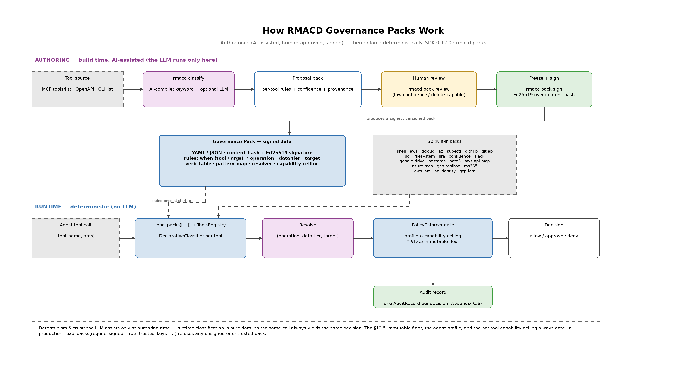

# Governance Packs — Authoring Guide

How to write a governance pack. Companion documents:
[README](README.md), [design](design.md), [roadmap](roadmap.md).

> A pack maps a tool call `(tool_name, args)` to RMACD terms
> `(operation, data_tier, target)` — as data, not code. This guide covers the
> anatomy of a pack, the three pack styles, the three classification primitives,
> fully worked examples (Jira, boto3, Azure MCP), and the required treatment of
> high-risk "passthrough" tools.

The lifecycle this guide walks through — author (AI-assisted), review the
uncertain tail, freeze and sign, then enforce deterministically (the LLM never
runs at runtime):



---

## 1. Anatomy of a pack

```yaml
pack: <name>                    # ecosystem identifier (e.g. kubectl, jira)
version: <semver>
description: <one line>
default_operation: <R|M|A|C|D>  # fail-closed default when no rule/verb matches
provenance:                     # who/what authored and reviewed this
  authored_by: <person/team>
  llm_assisted: <bool>
  reviewed_by: <person>
  source_hash: <sha256:…>       # hash of the tool defs this was compiled from
content_hash: <sha256:…>        # set by `rmacd pack sign`
signature: <…>                  # set by `rmacd pack sign`
resolvers:                      # optional named live-lookup hooks (see §4.3)
  - name: <resolver-name>
    description: <one line>
    fail_closed_default: <tier>
rules:                          # the classification rules (see §3)
  - id: <rule-id>
    when: { … }                 # selector
    parse: { … }                # optional extraction
    classify: { … }             # or verb_table + default
    confidence: <high|low>
```

A rule that does not set every field falls back to the pack/tool defaults; any
field a rule omits is filled from `default_operation`, the resolver/pattern_map
default, or the rendered target template.

## 2. Three pack styles

The verb that determines the operation lives in different places depending on the
tool surface. Knowing which style you are writing is the first decision.

### CLI-style (verb is inside a string argument)

Shells and cloud CLIs pass the whole command as one string:
`kubectl("delete pod …")`. Parse the string and match the verb with a
`verb_table`.

```yaml
- id: kubectl
  when: { tool: kubectl }
  parse: { arg: command, strip_wrappers: [sudo, env] }
  verb_table: { get: R, describe: R, apply: C, scale: C, create: A, delete: D }
  default: C
  tier:
    pattern_map:
      - { arg_regex: { arg: command, pattern: "-n\\s+prod" }, tier: confidential }
    default: internal
```

### MCP-style (verb is in the tool name)

MCP servers expose each capability as its own named tool: `jira_delete_issue`,
`jira_create_issue`. Match the tool name and assign a literal operation.

```yaml
- id: jira-delete
  when: { tool: jira_delete_issue }
  classify: { operation: D, tier: { resolver: jira_project_tier, from: project_key, default: confidential }, target: "jira://{project_key}/{issue_key}" }
```

### SDK / library style (verb is in the method name)

Cloud SDKs such as **boto3** expose operations as method names with consistent
verb prefixes (`describe_*`, `create_*`, `delete_*`). When an agent calls them
through a generic invoker — `aws_call(service, operation, params)` — extract the
leading verb token of the `operation` argument and match it with a `verb_table`.
Because the prefixes are uniform across hundreds of APIs, one small pack governs
the *entire* SDK. This is a passthrough surface (see §5) — cap it with a
worst-case ceiling. Full example in §4.2.

```yaml
- id: boto3-call
  when: { tool: aws_call }
  parse: { arg: operation, delimiter: "_", token: first }   # leading verb token
  verb_table: { describe: R, get: R, list: R, create: A, put: C, update: C, delete: D, terminate: D }
  default: C
  capability: { operations: [R, M, A, C, D] }               # passthrough → worst-case
```

## 3. The three primitives

| Primitive | Produces | Use when |
|-----------|----------|----------|
| `verb_table` | operation | the verb is a token in a parsed argument (CLI-style) |
| `pattern_map` | tier | the tier follows from a pattern in an argument |
| `resolver` | tier | the tier requires a live lookup (CMDB, tag store) |

Plus two literals — `operation:` and `target:` (a template with `{arg}` /
`{capture}` substitution).

### 3.1 `verb_table` (operation)

A token → operation map applied to a parsed command. **The result is the MAX
operation over every matched token**, so a compound command
(`get pods && delete pod x`) classifies as the most dangerous thing it contains.
Unmatched → the rule's `default` (fail-closed).

### 3.2 `pattern_map` (tier)

An ordered list of `regex on an argument → tier`. First match wins; if several
could apply, the most sensitive tier is taken. Falls back to `default`.

### 3.3 `resolver` (tier, live data)

A named hook declared in the pack and implemented once in the deployment:

```python
from rmacd.packs import register_resolver

@register_resolver("jira_project_tier")
def jira_project_tier(value: str, ctx) -> str:
    return cmdb.tier_for_project(value)   # "internal" | "confidential" | …
```

The engine guarantees fail-closed behavior: if the resolver raises or times out,
the pack's `fail_closed_default` is used, and the resolved value is recorded in
the audit record so the decision stays reconstructable. Write **one resolver per
concept**, not one per tool.

## 4. Worked examples

Three examples, each introducing something new: **Jira** (MCP-style + resolvers),
**boto3** (SDK-style governing a whole SDK with one verb table), and **Azure MCP**
(large namespaced server + cross-rule tier overlay).

> **Reference packs to read next.** The 22 built-in packs are worked examples in
> their own right. For the CLI-style + `restricted`-tier pattern in particular,
> read the three cloud-identity packs (`aws-iam`, `az-identity`, `gcp-iam`): each
> overlays a cloud CLI and raises IAM / directory / secrets / KMS operations to
> `restricted`, so a Change/Delete there meets the §12.5 floor. See
> [catalog.md](catalog.md) for the full generated reference.

### 4.1 Jira (MCP-style)

Jira is an MCP server, so this is an MCP-style pack. The same shape applies to
`confluence` (they ship from the same Atlassian MCP server).

```yaml
pack: jira
version: 1.0.0
description: RMACD classification for the Jira MCP server
default_operation: C            # unknown future tool → treat as risky

provenance:
  authored_by: platform-sec@acme
  llm_assisted: true
  reviewed_by: jdoe@acme
  source_hash: sha256:…
content_hash: sha256:…
signature: …

resolvers:
  - name: jira_project_tier
    description: Resolve a Jira project key to its data classification
    fail_closed_default: confidential

rules:
  - id: jira-read
    when: { tool: ["jira_search", "jira_get_*", "jira_list_*"] }
    classify:
      operation: R
      tier: { resolver: jira_project_tier, from: project_key, default: internal }
      target: "jira://{project_key}/{issue_key}"
    confidence: high

  - id: jira-add
    when: { tool: ["jira_create_issue", "jira_add_comment", "jira_add_attachment"] }
    classify:
      operation: A
      tier: { resolver: jira_project_tier, from: project_key, default: internal }
      target: "jira://{project_key}"
    confidence: high

  - id: jira-move
    when: { tool: jira_move_issue }
    classify:
      operation: M
      tier: { resolver: jira_project_tier, from: target_project_key, default: internal }
      target: "jira://{issue_key}->{target_project_key}"
    confidence: high

  - id: jira-change
    when: { tool: ["jira_update_issue", "jira_transition_issue", "jira_assign_issue"] }
    classify:
      operation: C
      tier:
        pattern_map:
          - { arg_regex: { arg: project_key, pattern: "^(SEC|HR|LEGAL)$" }, tier: confidential }
        resolver: jira_project_tier
        from: project_key
        default: internal
      target: "jira://{project_key}/{issue_key}"
    confidence: high

  - id: jira-delete
    when: { tool: jira_delete_issue }
    classify:
      operation: D
      tier: { resolver: jira_project_tier, from: project_key, default: confidential }
      target: "jira://{project_key}/{issue_key}"
    confidence: high
```

**How a call flows.** `jira_delete_issue(project_key="SEC", issue_key="SEC-42")`:

1. `jira-delete` matches → operation **Delete**; the `jira_project_tier` resolver
   returns **restricted** for `SEC`; target `jira://SEC/SEC-42`.
2. The evaluator sees Delete on restricted → the §12.5 immutable floor →
   **hard denied** (no exception possible).

`jira_search(project_key="ENG")` → Read on internal → allowed and logged. Same
pack, opposite outcomes, no hand-written classifier code.

### 4.2 boto3 (Python SDK via a generic invoker)

boto3 is the AWS Python SDK. Agents usually reach it through a single generic
invoker — `aws_call(service, operation, params)` — where `operation` is the boto3
method name. boto3's method names follow uniform verb prefixes across *every*
service, so one `verb_table` on the leading token classifies the entire SDK. This
is a **passthrough** tool (§5): its risk is in the argument, so it gets a
worst-case ceiling and a fail-closed default.

```yaml
pack: boto3
version: 1.0.0
description: RMACD classification for a generic boto3 invoker — aws_call(service, operation, params)
default_operation: C

provenance:
  authored_by: platform-sec@acme
  llm_assisted: true
  reviewed_by: jdoe@acme

resolvers:
  - name: aws_resource_tier
    description: Resolve an AWS resource identifier (bucket, ARN, instance id) to its tier
    fail_closed_default: confidential

rules:
  - id: boto3-call
    when: { tool: aws_call }
    # the boto3 method name is in `operation`; match on its leading verb token
    parse: { arg: operation, delimiter: "_", token: first }
    verb_table:
      describe: R
      get: R
      list: R
      head: R
      copy: M
      create: A
      register: A
      run: A           # run_instances
      import: A
      put: C           # put_* overwrites — treat as Change (conservative)
      update: C
      modify: C
      set: C
      attach: C
      detach: C
      associate: C
      enable: C
      disable: C
      start: C
      stop: C
      reboot: C
      tag: C
      delete: D
      terminate: D
      deregister: D
      purge: D
      release: D
      revoke: D
      cancel: D
    default: C          # unmatched/compound verb (e.g. batch_*) → fail-closed Change
    tier:
      pattern_map:
        - { arg_regex: { arg: params.Bucket, pattern: "(prod|pii|restricted)" }, tier: confidential }
      resolver: aws_resource_tier
      from: params
      default: internal
    target: "aws://{service}/{operation}"
    capability: { operations: [R, M, A, C, D] }   # passthrough → worst-case ceiling
    confidence: high
```

**Why this is powerful:** ~300 AWS services, one rule. `aws_call("s3",
"delete_object", {...})` → leading verb `delete` → **Delete**; `aws_call("ec2",
"describe_instances", {...})` → `describe` → **Read**. Note the deliberate
conservatism: `put_*` → Change (it overwrites), and anything the table doesn't
recognize (compound prefixes like `batch_*`) falls to the `C` default rather than
sneaking through as a Read.

### 4.3 Azure MCP (large namespaced server + tier overlay)

The Azure MCP Server exposes 40+ services as namespaced tools
(`azmcp_<service>_<verb>`) plus a passthrough that runs Azure CLI commands. Two
techniques shine here:

1. **Glob on the verb suffix** to write one rule per operation across all
   services (`azmcp_*_delete`).
2. **A tier-only overlay rule** for sensitive services: a rule that sets *only*
   the tier (no operation) and relies on cross-rule combination — the operation
   comes from the verb rule, the most-sensitive tier wins. This is how Key Vault
   becomes restricted no matter which verb is used, without repeating the tier on
   every rule.

```yaml
pack: azure-mcp
version: 1.0.0
description: RMACD classification for the Azure MCP Server (40+ services)
default_operation: C

provenance:
  authored_by: platform-sec@acme
  llm_assisted: true
  reviewed_by: jdoe@acme

resolvers:
  - name: azure_resource_tier
    description: Resolve an Azure resource group / resource id to its tier
    fail_closed_default: confidential

rules:
  # --- tier overlay: Key Vault / secrets are ALWAYS restricted (operation omitted) ---
  - id: az-keyvault-tier
    when: { tool: "azmcp_keyvault_*" }
    classify: { tier: restricted }      # no operation → combines with the verb rule below
    confidence: high

  # --- generic verb-suffix rules across every service ---
  - id: az-read
    when: { tool: ["azmcp_*_list", "azmcp_*_show", "azmcp_*_get", "azmcp_*_query"] }
    classify:
      operation: R
      tier: { resolver: azure_resource_tier, from: resource_group, default: internal }
      target: "azure://{service}/{name}"
  - id: az-add
    when: { tool: "azmcp_*_create" }
    classify:
      operation: A
      tier: { resolver: azure_resource_tier, from: resource_group, default: internal }
      target: "azure://{service}/{name}"
  - id: az-change
    when: { tool: ["azmcp_*_update", "azmcp_*_set"] }
    classify:
      operation: C
      tier: { resolver: azure_resource_tier, from: resource_group, default: internal }
      target: "azure://{service}/{name}"
  - id: az-delete
    when: { tool: "azmcp_*_delete" }
    classify:
      operation: D
      tier: { resolver: azure_resource_tier, from: resource_group, default: confidential }
      target: "azure://{service}/{name}"

  # --- passthrough: the Azure CLI execution / generation tool ---
  - id: az-cli
    when: { tool: ["azmcp_extension_az", "az_command"] }
    parse: { arg: command, strip_wrappers: [az] }
    verb_table: { show: R, list: R, get: R, create: A, update: C, set: C, delete: D, purge: D }
    default: C
    tier: { resolver: azure_resource_tier, from: command, default: internal }
    target: "azure-cli://{command}"
    capability: { operations: [R, M, A, C, D] }   # passthrough → worst-case ceiling
    confidence: high
```

**The overlay in action:** `azmcp_keyvault_secret_delete(...)` matches *both*
`az-delete` (→ operation Delete) and `az-keyvault-tier` (→ tier restricted).
Cross-rule combination takes the max operation and the most sensitive tier →
**Delete on restricted** → the §12.5 floor → hard denied. You expressed "secrets
are always restricted" once, and it correctly raised the tier on every Key Vault
operation.

## 5. Passthrough tools (mandatory treatment)

A tool that executes arbitrary commands, SQL, or APIs has no fixed operation —
its risk lives in the argument. Examples: a shell tool, a SQL `query` tool, the
AWS API MCP server, the Google Cloud DB toolbox, Azure CLI generation.

Required treatment:

1. **Arg-aware operation.** Use a `verb_table` over the action/verb in the
   argument (e.g. SQL `DROP`/`DELETE`/`TRUNCATE` → D; `UPDATE`/`INSERT` → C;
   `SELECT` → R). Never assign a flat literal operation.
2. **Worst-case capability ceiling.** Cap the tool at the most destructive
   operation it could perform, so an over-broad profile cannot be exploited
   through it.
3. **Fail-closed default.** Unrecognized input classifies at the pack default
   (typically C).
4. **Human review.** The AI-compile workflow flags every passthrough tool;
   review each one explicitly before signing.

## 6. Validate, review, sign

```bash
rmacd pack validate jira.yaml          # schema + ReDoS/lint checks
rmacd classify <mcp-server> -o draft.yaml   # AI-compile a first draft
rmacd pack review draft.yaml           # inspect low-confidence + passthrough tail
rmacd pack sign jira.yaml              # freeze: content_hash + ed25519 signature
rmacd pack verify jira.yaml            # confirm signature/trust before production use
rmacd pack diff jira.yaml <mcp-server> # detect drift when the tool surface changes
```

Once signed, a pack is immutable; a change is a new version (`name@version`).
Use `pack diff` periodically (or in CI) to catch tools whose definitions have
changed and re-review only those.

## 7. Checklist for a good pack

- [ ] Correct style chosen (CLI-style `verb_table`, MCP-style name match, or
      SDK-style method-verb table).
- [ ] `default_operation` set to a safe (high) value.
- [ ] Every passthrough tool classified arg-aware with a worst-case ceiling.
- [ ] Tiers default to the most sensitive plausible value, not the least.
- [ ] Resolvers declared with a `fail_closed_default`; one resolver per concept.
- [ ] Golden fixtures cover the riskiest calls (every Delete/Change path).
- [ ] Validated, reviewed, and signed before production use.
