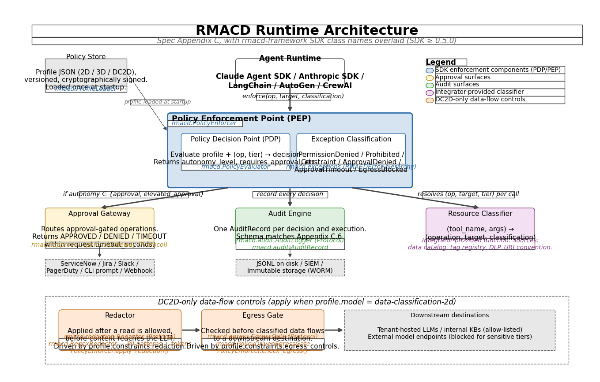

# Governance Packs — Technical Design

**Status:** Implemented in SDK 0.11.0 (`rmacd.packs`); catalog extended to 22
built-in packs in 0.12.0 (added the cloud-identity packs `aws-iam`,
`az-identity`, `gcp-iam`) and to **34 built-in packs** in 0.13.0 (developer
toolchain and enterprise-operations families), which also added **pack
composition** (`rmacd.packs.composition`) so multiple packs can govern the same
tool name. Companion documents: [README](README.md),
[roadmap](roadmap.md), [authoring guide](authoring-guide.md).

---

## 1. Problem

A tool call must be translated into RMACD terms — `(operation, data_tier,
target)` — before the evaluator can gate it. Today that translation is a Python
callable:

```python
# rmacd/registry/tools.py
ToolClassifier = Callable[
    [dict[str, Any]],
    tuple[Operation | str | None, DataClassification | str | None, str | None],
]
```

This has four consequences, all present in the current implementation:

1. **Every integration hand-writes classifiers** (~60–105 LoC per example),
   and two teams classifying the same tool drift apart.
2. **Classification cannot be shipped as data.** `ToolDefinition.to_dict()`
   drops the `classifier` ("a dynamic classifier is code and is not
   serialized"), so an exported registry loses its dynamic classification on
   round-trip — the accurate part (prod→confidential, `DROP TABLE`→Delete)
   evaporates.
3. **The one strong built-in classifier is unshippable.** `registry/bash.py` is
   a capable rule engine, but it is hardcoded Python, shell-specific, and cannot
   be reused, versioned, audited, or overridden without editing the SDK.
4. **AI classification is a runtime side-effect, not an authoring step.**
   `LLMToolClassifier` runs at registration and is advisory; there is no
   review → approve → freeze → sign → version path, so it cannot be the trusted
   source of truth for a regulated deployment.

**Goal:** make classification a declarative, reusable, versioned, signable
artifact (a *pack*), and turn the LLM classifier into a build-time *compiler*
that proposes packs for human review.

## 2. Principles (invariants)

- **Runtime stays 100% deterministic.** Packs only produce the
  `(op, tier, target)` input to the evaluator. The §12.5 immutable floor, the
  agent profile, and the tool capability ceiling remain the authoritative gates.
  The LLM never runs at enforcement time.
- **Fail-closed everywhere.** Unknown verb → pack default. Ambiguous tier →
  most sensitive. Multiple matches → highest operation, most sensitive tier
  (the existing `bash.py` rule). Resolver failure → most-sensitive default.
- **Declarative over code, for safety.** Data-driven matchers are sandboxable
  and auditable; arbitrary lambdas are neither.
- **Zero hot-path change.** A pack rule compiles into the existing
  `ToolClassifier` callable assigned to `ToolDefinition.classifier`. The
  enforcer's `enforce_tool_call` → `resolve_call(args)` path is untouched.
- **Backward compatible.** Existing Python classifiers keep working; packs are
  additive.

## 3. Architecture

Packs are compiled into classifiers when the registry loads; at runtime the
enforcer gates every call against the §12.5 floor, the agent profile, and the
tool capability ceiling. Packs sit *upstream* of that gate — they only produce
its `(operation, tier, target)` input — and the LLM is never on the runtime path:



The two-part flow in the abstract:

```
   ┌──────────── AUTHORING (build time, AI-assisted) ────────────┐
   │ discover → propose (keyword + LLM) → REVIEW → freeze + sign  │──┐
   │   rmacd classify <src>          rmacd pack review / sign     │  │
   └─────────────────────────────────────────────────────────────┘  │
                                                                      ▼
   ┌──────────── RUNTIME (deterministic, no LLM) ─────────┐   signed pack
   │ DeclarativeClassifier (compiled from pack)           │◀── (data, versioned)
   │  selectors → extractors → verb_table / pattern_map / │
   │  resolver → fail-closed combine → (op, tier, target) │
   └──────────────────────┬───────────────────────────────┘
                          ▼
   ToolDefinition.classifier (existing) → enforce_tool_call → §12.5 + profile + ceiling
```

Two parts: a **declarative classification language** (Part A, §4) and an
**AI-compile authoring workflow** (Part B, §5).

## 4. Part A — The declarative classification language

### 4.1 Pack structure

A pack is one validated document — YAML for authoring, canonical JSON for
hashing and signing.

```yaml
pack: aws-cli
version: 1.2.0
description: RMACD classification for the AWS CLI tool surface
default_operation: C            # fail-closed default when nothing matches
provenance:
  authored_by: platform-sec@acme
  llm_assisted: true
  reviewed_by: jdoe@acme
  source_hash: sha256:…         # hash of the tool definitions compiled from
content_hash: sha256:…          # canonical hash, set at freeze
signature: …                    # detached ed25519 over content_hash (optional)

resolvers:                      # named live-lookup hooks the pack expects
  - name: s3_bucket_tier
    description: Resolve a bucket name to its data classification via CMDB
    fail_closed_default: restricted

rules:
  - id: aws-s3-rm
    when: { tool: aws, argv_contains: { arg: command, tokens: [s3, rm] } }
    classify:
      operation: D
      tier: { resolver: s3_bucket_tier, from: bucket, default: confidential }
      target: "s3://{bucket}/{key}"
    confidence: high
  - id: aws-generic
    when: { tool: aws }
    parse: { arg: command, strip_wrappers: [sudo, env] }
    verb_table: { describe: R, get: R, cp: M, create: A, update: C, delete: D, terminate: D }
    default: C
    tier:
      pattern_map:
        - { arg_regex: { arg: command, pattern: "(prod|prd)-" }, tier: confidential }
      default: internal
```

### 4.2 Rule evaluation model

Each rule has three stages, each a small fixed vocabulary (no arbitrary code):

1. **Selector (`when`)** — does the rule apply?
   - `tool`: name match — exact, glob (`aws-*`), or `/regex/`.
   - argument predicates: `arg_equals`, `arg_regex`, `arg_present`,
     `argv_contains` (an ordered token sequence within a parsed command string).

2. **Extraction (`parse`)** — turn a string argument into tokens for verb
   matching. Generalizes `bash.py`: `strip_wrappers`, split on shell separators,
   recurse into `$(...)`. For tools that already expose discrete arguments, the
   argv is taken directly.

3. **Classification (`classify` / `verb_table`)** — produce `(op, tier, target)`:
   - **operation**: a literal, or a `verb_table` (token → operation, *result =
     MAX operation over every matched token*), with a fail-closed `default`.
   - **tier**: a literal, a `pattern_map` (regex on an argument → tier,
     most-sensitive wins), or a named `resolver`, each with a default.
   - **target**: a template with `{arg}` / `{capture}` substitution (generalizes
     the existing `target_template`).

**Cross-rule combination.** All matching rules are evaluated; the result is the
**maximum operation** and the **most sensitive tier**, with the first non-empty
target. This fail-closed combination preserves the property that a clever
argument can never *under*-trigger the §12.5 floor.

### 4.3 Why three primitives suffice

| Need | Example | Primitive |
|------|---------|-----------|
| Operation from a verb in a string arg | shell, SQL, kubectl, cloud CLIs | `verb_table` (max-op) |
| Tier from a resource-id pattern | `prod-*` → confidential | `pattern_map` |
| Tier from live resource metadata | bucket → CMDB classification | `resolver` |
| Target identity | `server://{server_id}` | `target` template |
| Static operation | a fixed-purpose tool | `operation` literal |

`bash.py` becomes the reference `shell` pack expressed in this language.

### 4.4 Resolvers — the live-data escape hatch

Some tier decisions require runtime data ("what is bucket X classified as in our
CMDB?"). Rather than per-tool lambdas, a pack *declares* a named resolver and the
deployment *registers* one implementation, reused across every rule and pack:

```python
@register_resolver("s3_bucket_tier")
def s3_bucket_tier(value: str, ctx) -> DataClassification:
    return cmdb.classification_for_bucket(value)   # fail-closed handled by engine
```

Rules:

- A resolver failure or timeout → the resolver's `fail_closed_default`, never
  "allow".
- The resolved value is **recorded in the audit record**, so a non-deterministic
  decision remains fully reconstructable.
- Resolvers are the *only* code in the classification path, and there is one per
  *concept* (not one per tool), so the integration surface collapses.

### 4.5 "Passthrough" tools

A tool that executes arbitrary commands, SQL, or APIs (a shell tool, a SQL
`query` tool, the AWS API MCP server, the Google Cloud DB toolbox, Azure CLI
generation) has no fixed operation — its risk lives entirely in the argument.
These are classified arg-aware (a `verb_table` over the action/verb), capped with
a worst-case capability ceiling, and given a fail-closed default. The
[authoring guide](authoring-guide.md) documents the required treatment, and the
AI-compile workflow flags every passthrough tool for explicit human review.

### 4.6 Safety considerations specific to declarative rules

- **Mis-classification = governance bypass.** A pack that calls a Delete tool
  "Read" is dangerous. Mitigations: (a) the per-tool **capability ceiling**
  defence-in-depth caps what a tool may represent; (b) packs are **signed** and
  provenance-tracked; (c) the agent profile gates independently.
- **Regex DoS.** Pack-supplied regexes run against arguments. The engine caps
  the input length fed to any pack regex (defence in depth), and `rmacd pack
  validate` runs `find_redos_risks` to flag over-long or nested-quantifier
  patterns at authoring time.
- **Untrusted packs.** Only signed packs (or packs from a configured trusted
  source) load in production; `pack verify` enforces this.

## 5. Part B — AI-compile authoring workflow

The LLM classifier becomes a build-time compiler producing a reviewable
artifact, not a runtime side-effect.

```
rmacd classify <source>          # MCP server | tools/list json | OpenAPI | CLI list
   → keyword heuristic (free, deterministic)        [existing mcp.py engine]
   → LLM for the low-confidence tail (or --all)     [existing llm.py engine]
   → emit pack.draft.yaml: per tool, proposed (op, tier, hitl, target rule),
        confidence, rationale, source_hash, engine provenance

rmacd pack review pack.draft.yaml # surfaces the low-confidence + passthrough tail first
   → human edits / approves

rmacd pack sign pack.draft.yaml   # freeze: content_hash + signature → pack.yaml
   → trusted, deterministic; runtime never calls the LLM

rmacd pack diff pack.yaml <source># drift: re-hash source defs; flag changed tools for re-review
```

Most of the machinery already exists and is reused: the keyword engine
(`MCPTool.to_rmacd_tool`), the structured LLM classifier
(`LLMToolClassifier.classify`), the provenance shape
(`metadata["classification"]`), and the low-confidence surfacing
(`MCPRegistryBridge.low_confidence_tools`). New work is the *emit-as-pack* step,
the review/sign/diff CLI, and the drift hashing.

## 6. SDK integration (minimal disruption)

New package `rmacd.packs`:

| New piece | Responsibility | Touches / reuses |
|-----------|----------------|------------------|
| `GovernancePack` | load / validate / canonicalize / hash / verify | `pack.schema.json` via the existing validator pattern |
| `DeclarativeClassifier` | compile a rule → a callable matching the existing `ToolClassifier` protocol | assigned to `ToolDefinition.classifier`; **no enforcer change** |
| `load_pack` / `load_packs` / `apply_pack` | register tools + compiled classifiers from packs | `ToolsRegistry.register_tool` |
| resolver registry | `register_resolver(name)` + lookup | used by `DeclarativeClassifier` |
| `compile_pack()` | AI-compile a source into a proposal pack | `LLMToolClassifier`, `MCPRegistryBridge` |
| CLI: `classify`, `pack validate/review/sign/diff/verify` | authoring + maintenance | existing `cli.py` |

Two small changes to existing code:

1. **Extend `ToolDefinition.to_dict/from_dict`** to serialize a *declarative*
   classifier spec — closing the round-trip gap. Code lambdas remain
   non-serializable (unchanged); declarative ones now survive export.
2. **Add `MCPRegistryBridge.compile_pack()`** — emit a pack rather than (or in
   addition to) registering directly.

Built-in packs ship as wheel data, exactly like the bundled schemas
(`rmacd/schemas/` → add `rmacd/packs/`). One-line integration:

```python
enforcer = PolicyEnforcer.from_env()
enforcer.registry = load_packs(["shell", "aws-cli", "kubectl", "acme/internal@2.1"])
# every adapter now just calls enforce_tool_call — no classifier code
```

## 7. Distribution, versioning, signing, drift

- **Format:** YAML authored, canonical JSON for hashing/signing.
- **Versioning:** semver per pack; packs are immutable once signed; a new
  version is a new artifact, referenced as `name@version`.
- **Distribution:** files first; optional OCI artifact / git source later
  (dovetails with a future control-plane).
- **Signing:** detached ed25519 signature over `content_hash`; `pack verify`
  enforces trust in production.
- **Drift:** each pack records the `source_hash` of the tool definitions it was
  compiled from; `pack diff` re-hashes the live source and flags changed tools
  for re-review.

## 8. Backward compatibility

- Existing Python `classifier` lambdas: unchanged, still supported.
- `enforce_tool_call`, the evaluator, and the §12.5 floor: untouched.
- The bundled `shell` pack reproduces current `bash.py` behavior; `bash.py` is
  retained as the fast engine, with golden parity tests between the two.

## 9. Decisions (resolved 2026-06-13)

| # | Decision |
|---|----------|
| 1 | **SDK-only first**, normative spec later — prove the format in the field before standardizing. |
| 2 | **Resolvers in scope for v1** — with fail-closed defaults and audit recording of resolved values. |
| 3 | **All pack families ship**, sequenced shell → cloud CLIs → dev tools → MCP servers (SaaS, cloud-provider, M365). |
| 4 | **Format:** YAML-authored, canonical JSON for hashing/signing. |
| 5 | **Module home:** `rmacd.packs` (new top-level package; named for the artifact to avoid colliding with the data-classification axis). |
| 6 | **Signing:** ed25519 detached signature over `content_hash`. |
| 7 | **`bash.py`:** kept as the fast engine alongside the `shell` data pack, with golden parity tests. |

## 10. Risks & mitigations

| Risk | Mitigation |
|------|-----------|
| Pack under-classifies → bypass | Capability ceilings + signing + independent profile gate |
| Declarative language too weak for a real case | `resolver` escape hatch covers live-data needs |
| Language grows into a Turing tarpit | Fixed primitive set; escalate to a resolver rather than adding conditionals/loops |
| Regex DoS from packs | Engine input-length cap + `find_redos_risks` flagging at `pack validate` time |
| Resolver non-determinism | Fail-closed default + resolved value recorded in audit |
| Drift unnoticed as tools change | `source_hash` + `pack diff` maintenance loop |
