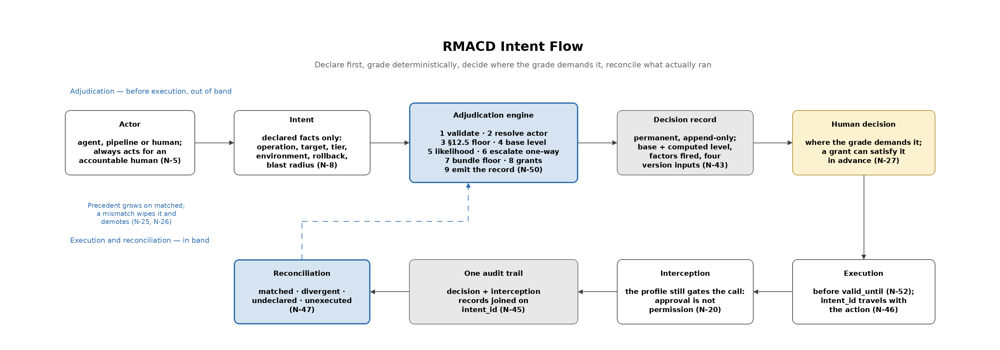

# RMACD Intents — The Intent Model

**Companion to:** `RMACD_Framework_v1.4.md` (§2.4, §3, §12)
**The rules:** [`intent-specification.md`](intent-specification.md) — envelope, actor model, adjudication contract, the checklist
**Status:** Capability definition. No SDK implementation ships with this revision.

The framework's original enforcement mode is *interception*: a hook inside the
agent's runtime classifies each tool call and evaluates it against a bound
profile before the tool runs. Interception is powerful, but it governs only
what it can instrument.

This document defines a second, complementary mode — *adjudication* — in which
an actor declares what it wants to do and a deterministic engine grades the
declaration before the action runs. This document explains the model and why
it is built this way; the [Intent
Specification](intent-specification.md) states the rules an implementation
has to follow.

## Contents

- [1. What an RMACD Intent is](#1-what-an-rmacd-intent-is)
- [2. Why intents](#2-why-intents)
- [3. The intent ladder](#3-the-intent-ladder)
- [4. Two planes, one protocol](#4-two-planes-one-protocol)
- [5. The intent type registry](#5-the-intent-type-registry)
- [6. The actor model](#6-the-actor-model)
- [7. Adjudication](#7-adjudication)
- [8. Campaigns, budgets and emergencies](#8-campaigns-budgets-and-emergencies)
- [9. What intents change about oversight](#9-what-intents-change-about-oversight)
- [10. Relationship to the exception process](#10-relationship-to-the-exception-process)
- [11. A worked example](#11-a-worked-example)
- [12. Adopting intents in stages](#12-adopting-intents-in-stages)
- [See also](#see-also)

## 1. What an RMACD Intent is

An RMACD Intent is a structured declaration of something an actor wants to do,
submitted for adjudication before it is done.

The actor declares *facts* — the operation, the target, the context. The
framework computes the *rating* — the required oversight level — by
deterministic rule. The actor never rates itself. That single division of
labour is the entire trust model: actors request; the engine grades; humans
oversee where the grade demands it.

One sentence for the whole capability: **every actor in the organization —
agent, pipeline, or human — asks first, in a form a deterministic engine can
answer.**



---

## 2. Why intents

Interception requires the governed actor to be instrumented: the SDK, a hook,
or an adapter must live in the execution path. Intents invert the flow. The
actor declares before acting, and adjudication becomes a question any actor can
ask — an API call, a file in a pipeline, a form submission. Nothing needs to be
instrumented to be governed.

The two modes are complementary, not competing.

| | Intent (adjudication) | Interception (enforcement) |
|---|---|---|
| Position | Before execution, out-of-band | During execution, in-band |
| Requires instrumentation | No | Yes |
| Guards against | Unplanned risk | Undeclared behaviour |
| Failure it cannot see | An actor that declares and then does something else | An actor that was never instrumented |

Each mode's blind spot is the other's coverage, which is why a mature
deployment runs both: intents for triage and records, interception to verify
that the executed action matched the declared intent. The two decision streams
join in the audit trail on `intent_id`, and **declared-one-thing-did-another
becomes a detectable, citable event** rather than an invisible one. This
reconciliation is the single strongest reason to adopt both modes together;
neither mode produces it alone.

The deeper reason is citizenship. Agents are becoming first-class citizens of
enterprise IT — provisioned, identified, orchestrated, and composed like any
core entity. Citizenship cuts both ways: full privileges carry full
obligations. An agent that can act like a service must be governed like one.
The intent is the citizenship contract — the mechanism by which every actor
exercises the privilege of changing systems by accepting the obligation of
declaring first.

---

## 3. The intent ladder

Intents aggregate. Each rung reuses the same engine at a higher level of
composition.

| Rung | Governs | Evaluated | Notes |
|---|---|---|---|
| **Action intent** | One tool call | At execution time, by interception | The tool call *is* the intent, discovered rather than declared |
| **Change intent** | One declared operation on one target | Before execution, out-of-band | The building block; decoupled from any runtime |
| **Release intent** | A manifest of change intents shipping together | Before execution, one gate | Inherits the scrutiny of its most severe item |
| **Campaign intent** | A bounded *class* of changes | Once, in advance | Humans approve classes, not instances |

The action intent is what interception already evaluates implicitly. The change
intent makes it explicit and moves adjudication ahead of execution. The release
intent bundles changes that ship together, and **no item is ever judged more
leniently for travelling in benign company** — the bundle inherits the most
restrictive level among its children. The campaign intent is how the model
survives fleet scale: one human decision authorizes a bounded class, and
matching child intents adjudicate against that grant deterministically.

The bundling rule generalizes beyond releases. For *any* intent that bundles
others, the computed level is the most restrictive of its children, and
membership in a bundle never lowers a child's own level. This is the same
floor semantics that already governs Governance Pack composition, where adding
a pack can only ever make a call look more dangerous. A bundle is also decided
children-first: no release is approved while a change inside it is still
ungraded — N-63 (Children Are Graded First).

---

## 4. Two planes, one protocol

Adjudicable actions exist in two planes, and the same protocol governs both.

**The production plane** — intents that mutate systems: changes, releases,
deployments, decommissions. This is where the framework's operations
(R/M/A/C/D) act on infrastructure and applications.

**The record plane** — intents that create or update the constructs of IT
service management itself: raising an incident, submitting a service request,
opening a problem record. Raising a request is a record-plane act; *fulfilling*
it is production work, which is why the `service_request` type sits on the
production plane. These are real `(operation, target)` actions —
creating an incident is an Add on the incident record system — and they are
adjudicated for real reasons: an agent fleet raising fifty thousand incidents
is a denial-of-service on human attention, so the same budgets, deduplication,
and matrix apply.

Governing the record plane must never make it harder to report a real problem.
The framework therefore fixes an explicit safety invariant:

> **First-report invariant.** Record-plane budgets and deduplication may
> throttle repetition and volume. They may never delay, gate, or suppress the
> first report of a distinct condition within its deduplication window —
> N-70 (First Reports Are Never Gated).

In practice a single incident from a well-behaved actor lands at the base
matrix level — for most deployments Logged or Notification — and the record
plane only bites at volume, through budgets rather than through the matrix.
Adjudication of the record plane is a control on fleets, not a checkpoint on
first responders.

What is *not* an intent in either plane is cognitive work — diagnosis, triage
judgment, root-cause analysis. Those are the processes that run *between*
intents: they consume record-plane intents (an incident arrives) and produce
production-plane intents (remediation changes go out). Because the reasoning
itself is ungoverned, a decision record captures the facts an actor declared,
never the reasoning that produced them; intents that carry a `rationale`
provenance link are easier to audit after the fact.

The result: agents receive governed access to every construct they can act on —
request it, report it, change it, ship it — through one adjudicated protocol,
while the thinking in between remains human and machine process.

---

## 5. The intent type registry

Intent types form an open registry. Every registered type is a first-class
citizen of the type system — one common envelope, one actor model, one
adjudication contract, one audit trail, and composition with each other. No type
outranks another; the only structure is the dependency tree, and the only
labels are maturity, which signal semantic stability, never rank.

| Intent type | Governs | Plane | Composes / requires |
|---|---|---|---|
| `change` | One operation on one target | Production | — (the building block) |
| `release` | A unit of change intents approved to ship | Production | composes `change` |
| `deployment` | Moving an approved release into an environment | Production | requires `release` |
| `service_request` | A catalogued, pre-authorized request | Production | grants over `change` |
| `decommission` | Staged, irreversible retirement of a service | Production | composes `change` |
| `maintenance_window` | Planned unavailability against a service commitment | Production | cited by `deployment` |
| `continuity_invocation` | Invoking a pre-approved continuity/DR plan | Production | grant + trigger |
| `incident` | Raising an incident record | Record | produces `change` |
| `campaign` | A bounded grant for a class of changes | Grant | grants over `change` |
| `exception` | Temporary, expiring widening of a profile | Grant | grants over `change` |

Grant is not a third plane of action. `campaign` and `exception` are
meta-intents: they carry a human decision over a bounded class of future
production-plane intents, and they are the only two types that carry the grant
machinery the rules specify in their §7.

The registry is open by design: new types register against the common envelope
and contract without amending the model's core. The `change` intent is the
building block not because it contains the others, but because one
`(operation, target)` is the quantum of adjudicable action — every other type's
effect decomposes into it, which is what lets one deterministic engine
adjudicate every type.

`exception` is the framework's existing §12.3 process expressed as a registered
type; see [§10](#10-relationship-to-the-exception-process).

---

## 6. The actor model

Every intent carries an actor block: `kind` (`agent`, `pipeline`, or `human`),
an identity, an authorization reference, and — mandatory for non-human actors —
`on_behalf_of`, the accountable human or team.

Adjudication is actor-agnostic: the engine answers identically regardless of who
asks. Actor kind matters only for routing (which approval channel) and
accountability (who answers for the action).

Three rules are absolute:

1. **Non-human actors always trace to accountable humans.** An `agent` or
   `pipeline` intent without a resolvable `on_behalf_of` is malformed —
   N-5 (Every Agent Has a Human).
2. **Unknown actors fail closed.** An unresolvable authorization routes every
   non-Read operation to Approval at minimum, and Read too on confidential or
   restricted data, regardless of what the matrix would otherwise compute —
   N-6 (Fail Closed on Unknown Actors).
3. **Ratings are computed, never claimed** — by any actor, of any kind. An
   actor can misdeclare facts, which reconciliation detects and demotion
   punishes. An actor can never argue with the rating — N-8 (No Self-Assigned Rating).

---

## 7. Adjudication

Adjudication is a deterministic function from a declared intent to one of the
framework's six autonomy levels — Autonomous, Logged, Notification, Approval,
Elevated Approval, Prohibited — exactly as defined in §2.4. **Intents add no
oversight vocabulary and no second matrix.** Every mechanism in this model only
changes *which* level an intent lands on, never what a level means, and never
where the level comes from.

### 7.1 One matrix, escalated

The framework already grades an action: the §3.1 matrix maps
`(data classification, operation)` to a required autonomy level, adjusted by the
actor's profile. Intents do not introduce a competing grade — N-13 (One Matrix, No Second). They compute a
**base level** from the existing matrix and then apply **one-way escalation**
driven by likelihood:

```
base  = effective_matrix[classification][operation]   # §3.1, unchanged
level = escalate(base, likelihood_steps)              # one-way, toward more oversight
                                                      # stops at Elevated Approval
```

`escalate` moves the level along the §2.4 ladder toward more oversight, never
less — and stops at Elevated Approval. Likelihood can demand the CISO; it can
never reach Prohibited. Prohibited means *no human decision can authorize
this for an agent*, which is a categorical statement about an action, not a
verdict on how novel one request happened to be. Were escalation allowed to run
to the end of the ladder, an ordinary production change on confidential data —
already at Elevated Approval by default — would become a deterministic deny the
first time anyone tried it.

This yields the property that makes the model safe to build on:

> **Nothing an actor declares can produce less oversight than v1.4 already
> required.** Risk-reducing facts do not subtract scrutiny; they merely fail to
> add any. An actor that lies about its rollback plan lands, at best, back on
> the framework's own baseline.

That closes what would otherwise be the model's soft centre. Because the actor
supplies the facts, any factor capable of *lowering* a level would be
self-rating with extra steps. Under one-way escalation, no such factor exists.

### 7.2 The two dimensions

**Impact** — consequence severity if the action goes wrong. The framework
already carries this axis: the data classification tier *is* the impact
dimension, and irreversibility is already partly encoded in the operation
ordering, since D ⊃ C ⊃ A ⊃ M ⊃ R ranks operations by the difficulty of undoing
them. Organizations may substitute or supplement classification with CMDB
criticality or service tier, provided the substitution is declared in the
profile and stamped into the decision record.

**Likelihood** — probability of an adverse outcome. This is the genuinely new
computation, and it is derived only from facts the engine can check or
reconcile:

| Factor | Raises likelihood when |
|---|---|
| Unprecedented | No prior confirmed success of this *action pattern* in the decision log |
| Reversibility | No attested rollback path |
| Environment | Production or disaster-recovery, versus staging or development |
| Budget standing | The actor is at or over its autonomy budget, or currently demoted |
| Blast radius | The declared scope approaches or exceeds the profile's declared caps |

Precedent is memory: the decision log is simultaneously the evidence artifact and
the input that lets a well-trodden action stop costing human attention. The
*action pattern* over which precedent is counted is the security-critical definition in
the whole model — whatever the action pattern key ignores becomes a gradient an actor can
walk down to erode its own scrutiny — and the rules define it exactly,
down to the byte form of the hash, so that two implementations counting
precedent count the same thing (N-22, N-56).

### 7.3 Determinism is not statelessness

Adjudication is deterministic, but it is not a pure function of the intent
alone: precedent and budget standing read organizational state. The precise
claim is that adjudication is reproducible given the intent together with the
matrix version, the likelihood weight-table version, the policy version, and
the decision-log epoch — all four versions the decision record stamps, so that
any past decision can be recomputed and defended years later — N-21 (Same
Inputs, Same Level). The epoch is what pins the stateful half: it names the
decision-log state the grading read, and it moves whenever that state does —
N-60 (The Epoch Names the State).

### 7.4 The prohibited floor carries forward

The §12.5 immutable floor maps into this model unchanged — N-12 (The Permanent No). Because escalation
cannot reach Prohibited, there are exactly two ways an intent gets there — and
neither of them is likelihood:

| | Pinned Prohibited | Extended Prohibited |
|---|---|---|
| Source | §12.5 — A, C or D on Restricted | An organization's own declared prohibition |
| Set by | The framework | The deploying organization |
| Can it be removed? | Never | By the organization that declared it |
| Can it be narrowed below §12.5? | Never | Never |
| Emergency flag | Immune | Immune |
| Campaign / exception cover | Never | Never |

The prohibited region is therefore immutable at its core, extensible outward,
and never shrinkable — organizations may forbid more than the framework does,
never less.

Some things an autonomous actor can never do, under any computation, and the
intent model preserves that guarantee at any volume. **A deterministic deny is
the one control whose cost does not grow with scale.**

### 7.5 The profile remains a ceiling

Adjudication never grants. An approved intent does not confer permission the
actor's profile lacks: the profile's permission grid and any tool capability
ceiling still gate execution, and adjudication can only raise scrutiny above
what they require. An intent that clears adjudication and is then refused by
interception is a correctly functioning system, not a contradiction — N-20
(Approval Is Not Permission).

### 7.6 The decision record

Every adjudication produces a permanent decision record — the declared facts,
the computed base and final levels, every escalation factor that fired, the
matrix, weight-table and policy versions, the log epoch, and any approver's
recorded decision. It joins the same audit trail as interception decisions, on
`intent_id` — N-43 (The Permanent Decision Record) and N-45 (One Audit Trail).
Rejections are recorded too, in the same trail but never as decision records,
so an auditor can count what was refused at the door as easily as what was
graded — N-59 (Rejections Leave a Trace).

---

## 8. Campaigns, budgets and emergencies

These three mechanisms are what let the model scale without either drowning
humans or quietly weakening itself.

### 8.1 Campaigns are pre-recorded approval, not waived approval

A campaign grant does **not** lower a child intent's computed level — that
would break the one-way rule. Instead it supplies a human decision *in
advance*: the approval requirement is satisfied by a recorded human decision
rather than waived — N-27 (Grants Approve, Never Lower). A matching child is
covered only when every condition holds:

- the child matches the campaign's class match rule deterministically;
- the child's computed level is no more restrictive than the level the human
  approved the campaign at;
- the campaign's caps — child count, blast radius, expiry — are not exhausted;
- the child is not Prohibited, whether pinned by §12.5 or extended by the
  organization.

A child that computes *above* the campaign's approved level is not covered and
routes to a human individually. The grant itself is graded by the most severe
cell its class can cover, never by facts the requester chose to write in the
grant document, and never below the level it is capped at — N-66 (A Grant Is
Graded by Its Reach), N-67 (A Grant Is Never Graded Below Its Cap). And it
always receives a human decision, whatever level it computes to — N-68 (Every
Grant Gets a Human Decision). An exception, likewise, covers only the profile
and actor it names. This is the same idea as an ITIL standard
change: still governed, its approval pre-granted by an approved model.

Campaigns are the highest-leverage object in the model and therefore the most
dangerous: a loose class match rule turns a single approval into a permission
laundering channel. The rules constrain match rules to a closed
set of matchable fields, make expiry mandatory, require that revocation
take effect immediately, and make cap checks atomic so that concurrent
children cannot spend the same capacity twice — N-55 (Caps Count Once).

### 8.2 Budgets give teeth to controls the framework already declares

Autonomy budgets are not a new concept so much as enforcement for one the
framework already carries. Profiles already declare `rate_limits`,
`change_controls` and `max_blast_radius_percentage`. Intents make those
declarations consequential: budget standing is a likelihood input, so a
breach escalates automatically for as long as the actor is over budget (N-39).
Demotion, which follows a reconciliation mismatch, is the persistent form of
the same escalation rather than a new state (N-40).

### 8.3 Emergencies raise ceilings; they never lower grades

An intent may cite an active emergency escalation as defined by its profile's
`emergency_escalation` block — the same trigger conditions, duration cap,
cooldown and post-incident review the framework already specifies. An
emergency raises the *permission ceiling*; it never lowers a computed level,
and it never touches the §12.5 pinned cells — N-42 (Emergencies Never Lower
Grades).

---

## 9. What intents change about oversight

At low volume, intents make oversight *precise*: every gated action arrives
pre-classified, with its reasoning attached, in the channel the right human
already works in.

At fleet scale, intents make oversight *possible*. Humans stop approving
instances and start governing:

| Humans govern | Through | Instead of |
|---|---|---|
| Classes | Campaign grants | Approving each instance |
| Envelopes | Autonomy budgets, which escalate on breach and demote on mismatch | Watching each actor |
| Anomalies | Drift in the decision stream itself | Reading every decision |

An intent landing at a human is reframed from workflow event to **policy defect
signal** — the queue becomes a metric driven toward zero, and the review board is
reborn as a policy board.

---

## 10. Relationship to the exception process

The framework already has a request pipeline. §12.3 defines five steps —
Request Submission, Risk Assessment, Approval Decision, Exception Activation,
Exception Closure — with a JSON template at §12.4 that, from v1.0 until this
revision, advertised a `schema/v1/exception.json` that was never published.

An exception request *is* an intent: a declared, justified, time-bounded ask,
submitted for adjudication before it takes effect. Rather than adding a second
request path to a framework that already has one, Intents register `exception`
as a type, and §12.4's template is now written in the intent envelope and points
at `schema/v2/intent.json`. The framework carries one request path; the
unpublished `exception.json` URL is retired rather than filled in.

| §12.3 step | Intent model |
|---|---|
| 1. Request Submission | Submit an `exception` intent |
| 2. Risk Assessment | Adjudication computes the level deterministically |
| 3. Approval Decision | Human decision recorded against the computed level |
| 4. Exception Activation | Grant becomes active; caps and expiry enforced |
| 5. Exception Closure | Expiry or revocation; decision record closes the loop |

The human judgment in Step 2 is not removed — it is relocated. The engine
computes *how much* scrutiny the request needs; the named authority in §12.2
still decides whether to grant it — N-37 (Scrutiny, Not the Decision). Every
§12.5 prohibition continues to apply, and two of the five are now enforced by
schema as well as by process: an `exception` intent cannot escalate Restricted
beyond R and M, and cannot omit an expiry. The remaining three — no removal of
audit logging, no cross-environment exception, no blanket grant — are not
expressible in a per-document schema and remain the implementation's duty at
grant submission — N-36 (The Five Named Prohibitions).

Nothing in §12 changes semantically. This document and the rules
describe the same process in the intent envelope's terms.

---

## 11. A worked example

The repository carries worked JSON for every major object —
[`schemas/examples/intents/`](../schemas/examples/intents/) holds a production
change, a composed release, a record-plane incident, a campaign grant, an
urgent exception and a decision record, each validating against the published
schemas. This section walks the production change through the nine steps of
the adjudication algorithm (spec §5.1), so the machinery is visible end to
end.

The intent, abridged (justification, tags and provenance omitted) from
[`change-production.json`](../schemas/examples/intents/change-production.json):
a DevOps agent, acting for the platform team, wants to raise a connection-pool
limit on the payments API in production.

```json
{
  "intent_id": "int-chg-20260815-0031",
  "intent_type": "change",
  "submitted_at": "2026-08-15T09:14:00Z",
  "valid_until": "2026-08-15T18:00:00Z",
  "actor": {
    "kind": "agent",
    "id": "devops-agent-007",
    "authorization": "spiffe://corp/ns/agents/devops-agent-007",
    "on_behalf_of": "platform-team@company.com"
  },
  "declaration": {
    "operation": "C",
    "target": "svc://payments-api/config/connection-pool",
    "target_class": "svc://payments-api/config/*",
    "data_classification": "confidential",
    "environment": "production",
    "reversibility": {
      "rollback_declared": true,
      "attested_by": "release-engineering@company.com"
    },
    "blast_radius": { "scope_percentage": 4 }
  }
}
```

The trace, under the shipped `rmacd-3d-devops-v1` profile and the default
weight table:

| Step | What happens | Result |
|---|---|---|
| 1. Validate | The envelope conforms; `valid_until` present, as required on a production-plane type | accepted |
| 2. Resolve the actor | `authorization` resolves; `on_behalf_of` names an accountable team | resolved |
| 3. Prohibited floor | Change on *confidential* is not in the §12.5 set (that set is A, C, D on *restricted*) | continue |
| 4. Base level | The devops profile declares no override for Change on confidential, so the §3.1 default applies | `elevated_approval` |
| 5. Likelihood | Unprecedented: no reconciled success for this pattern yet, **+1**. Reversibility: rollback attested by release engineering, +0. Environment: production, **+1**. Budget: in good standing, +0. Blast radius: 4%, well inside the cap, +0 | 2 steps |
| 6. Escalate | `elevated_approval` is already the top of the escalable ladder; two steps move it nowhere — escalation stops below Prohibited | `elevated_approval` |
| 7. Bundle floor | A `change` bundles nothing | unchanged |
| 8. Grant coverage | No `grant_ref` claimed | routes to a human |
| 9. Emit | One decision record: base, computed level, both factors that fired, all four version inputs | permanent record |

Two things are worth noticing in that trace. The two escalation steps were
*absorbed* — the base was already at the ceiling — yet they still appear in
the decision record, because the record captures what fired, not only what
moved the needle. And the rollback attestation bought no discount; what it did
was *fail to add* the reversibility step, which is the one-way rule doing its
job quietly.

Run the same intent again after this one succeeds and reconciles, and step 5
loses the unprecedented factor. Run it in staging, and it loses the
environment step and the base drops to whatever the matrix requires there.
Cover it with a campaign approved at `elevated_approval`, and step 8 satisfies
the approval in advance instead of routing to a human — the level never
changes, only who already said yes.
[`decision-record.json`](../schemas/examples/intents/decision-record.json)
shows a complete record for a neighbouring change on internal data, where
the same two factors *did* move the level, from `approval` to
`elevated_approval`.

---

## 12. Adopting intents in stages

The checklist in the specification is split into three cumulative
implementation levels (spec §11.1), and they are also the sensible adoption
path — each stage is useful on its own and none requires the next.

**Stage 1 — Adjudicate (L1).** Grade declarations and keep records. Every L1
checklist item can be met with paper, which is deliberate: a change advisory
board with a form, a register and a filing discipline is already an L1
implementation. Start on whichever plane hurts most — for most fleets that is
the record plane, because incident flooding arrives before production
autonomy does. What you get: every ask lands pre-classified, and the decision
log starts accumulating the precedent that later stages spend.

**Stage 2 — Reconcile (L2).** Join execution back to declarations. This is
where interception and adjudication meet: `intent_id` travels into the
execution path, interception records join the decision log, and
declared-one-thing-did-another becomes a detectable event. Precedent becomes
trustworthy at exactly this point — which is why the specification refuses to
count unreconciled successes at any level (N-25). What you get: the
unprecedented factor starts retiring itself, and routine work stops costing
human attention.

**Stage 3 — Delegate (L3).** Turn repeated individual approvals into
campaigns, and profile widenings into exception intents. Grants are the
highest-leverage and most dangerous object in the model, which is why they
come last: a campaign over a class you have never reconciled is an approval
nobody will ever check up on. What you get: humans govern classes and
envelopes, the approval queue becomes a policy-defect signal, and fleet scale
stops being a governance problem.

A useful discipline at every stage is *shadow mode*: grade real declarations
and write real records while enforcing nothing, then read the decision stream
for a few weeks. The stream tells you which overrides your profiles are
missing, which action patterns dominate, and what your approval load will be —
before a single actor is gated on it.

---

## See also

- [`intent-specification.md`](intent-specification.md) — the rules: envelope,
  actor model, adjudication contract, decision record, the checklist and its
  three implementation levels, security considerations.
- `schemas/intent.schema.json` — the intent envelope and per-type constraints.
- `schemas/intent-decision.schema.json` — the decision record.
- [`schemas/examples/intents/`](../schemas/examples/intents/) — worked JSON:
  a production change, a composed release, an incident, a campaign, an urgent
  exception, a decision record.
- `RMACD_Framework_v1.4.md` §2.4 (autonomy levels), §3 (the matrix),
  §12 (exceptions and the immutable floor).
